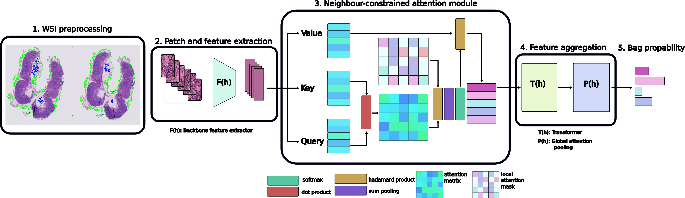

# CAMIL: Context-Aware Multiple Instance Learning for Whole Slide Image Classification

This is an implementation of our model CAMIL (Context-Aware Multiple Instance Learning for Whole Slide Image Classification). CAMIL leverages the dependencies among single tiles within a WSI and imposes contextual constraints as prior knowledge to multiple instance learning model. We tested CAMIL on the subtyping of non-small cell lung cancer (NSLC) and lymph node (LN) metastasis, and the results demonstrated its superiority over other state-of-the-art weakly supervised classification algorithms. 

[](https://www.repostatus.org/#active)



### To install

We recommend creating a new conda environment. In the terminal, run:
```bash 
conda env create --file exp.yml

pip install --upgrade pip
``` 
This should take ~5mins or less.

### Hardware requirements
We have tested this software on an Ubuntu 20.04LTS and 18.04LTS with 128Gb RAM and NVIDIA Quadro RTX 6000 GPU.

Using the publicly available CLAM WSI-prepossessing toolbox, we first automatically segmented the tissue region from each slide and exhaustively divided it into 256x256 non-overlapping patches using $\times 20$ magnification. It is important to note that using different parameters in the feature extraction process can lead to different training and test sets, which can subsequently result in different model performance. To ensure the reproducibility of our results, we provide the features that we used in our study.[h5_files](https://drive.google.com/drive/folders/1sJ4EuY08EIw6bpXoMcUhr0rga7YXyHot?usp=sharing)


### SimCLR model


The datasets used for
SimCLR consist of patches extracted from the WSIs. To extract the patches run the folloqing command:

```bash 
python extract_simclr_patches.py --simclr_h5_dir simclr_imgs/ --data_h5_dir  patches/  --data_slide_dir  --csv_path /data/scratch/DBI/DUDBI/DYNCESYS/OlgaF/camelyon17/process_list_autogen.csv --slide_ext .tif
```
To run the simCLR model run:

```bash 
python run_simclr.py --simclr_h5_dir simclr_imgs/ --data_h5_dir  patches/  --data_slide_dir  --csv_path /data/scratch/DBI/DUDBI/DYNCESYS/OlgaF/camelyon17/process_list_autogen.csv 
```

## Usage
To run the CAMIL model:

```bash 
python run.py  --k 3 --experiment_name exp_name  --feature_path h5_files --label_file label_files/camelyon_data.csv --csv_file camelyon_csv_files/splits_0.csv
```


